# PUBG Finish Placement Prediction
## Problem Statement:
You must create a model which predicts players' finishing placement based on their final stats, on a scale from 1 (first place) to 0 (last place)
## Target Output
winPlacePerc - This is a percentile winning placement, where 1 corresponds to 1st place, and 0 corresponds to last place in the match. It is calculated off of maxPlace, not numGroups, so it is possible to have missing chunks in a match.
### Data Dictionary:

##### Data Dictionary:

* **DBNOs** - Number of enemy players knocked.
* **assists** - Number of enemy players this player damaged that were killed by teammates.
* **boosts** - Number of boost items used.
* **damageDealt** - Total damage dealt. Note: Self inflicted damage is subtracted.
* **headshotKills** - Number of enemy players killed with headshots.
* **heals** - Number of healing items used.
* **Id** - Player’s Id
* **killPlace** - Ranking in match of number of enemy players killed.
* **killPoints** - Kills-based external ranking of player. (Think of this as an Elo ranking where only kills matter.) If there is a **value other** than -1 in rankPoints, then any 0 in killPoints should be treated as a “None”.
* **killStreaks** - Max number of enemy players killed in a short amount of time.
* **kills** - Number of enemy players killed.
* **longestKill** - Longest distance between player and player killed at time of death. This may be misleading, as downing a player and driving away may lead to a large longestKill stat.
* **matchDuration** - Duration of match in seconds.
* **matchId** - ID to identify match. There are no matches that are in both the training and testing set.
* **matchType** - String identifying the game mode that the data comes from. The standard modes are “solo”, “duo”, “squad”, “solo-fpp”, “duo-fpp”, and “squad-fpp”; other modes are from events or custom matches.
* **rankPoints** - Elo-like ranking of player. This ranking is inconsistent and is being deprecated in the API’s next version, so use with caution. Value of -1 takes place of “None”.
* **revives** - Number of times this player revived teammates.
* **rideDistance** - Total distance traveled in vehicles measured in meters.
* **roadKills** - Number of kills while in a vehicle.
* **swimDistance** - Total distance traveled by swimming measured in meters.
* **teamKills** - Number of times this player killed a teammate.
* **vehicleDestroys** - Number of vehicles destroyed.
* **walkDistance** - Total distance traveled on foot measured in meters.
* **weaponsAcquired** - Number of weapons picked up.
* **winPoints** - Win-based external ranking of player. (Think of this as an Elo ranking where only winning matters.) If there is a value other than -1 in rankPoints, then any 0 in winPoints should be treated as a “None”.
* **groupId** - ID to identify a group within a match. If the same group of players plays in different matches, they will have a different groupId each time.
* **numGroups** - Number of groups we have data for in the match.
* **maxPlace** - Worst placement we have data for in the match. This may not match with numGroups, as sometimes the data skips over placements.
* **winPlacePerc** - The target of prediction. This is a percentile winning placement, where 1 corresponds to 1st place, and 0 corresponds to last place in the match. It is calculated off of maxPlace, not numGroups, so it is possible to have missing chunks in a match.


```python
# This Python 3 environment comes with many helpful analytics libraries installed
# It is defined by the kaggle/python docker image: https://github.com/kaggle/docker-python
# For example, here's several helpful packages to load in 

import numpy as np # linear algebra
import pandas as pd # data processing, CSV file I/O (e.g. pd.read_csv)
import matplotlib.pyplot as plt
# Input data files are available in the "../input/" directory.
# For example, running this (by clicking run or pressing Shift+Enter) will list the files in the input directory
import seaborn as sns
import os
print(os.listdir("data"))

# Any results you write to the current directory are saved as output.
```

    ['test_V2.csv', 'sample_submission_V2.csv', 'train_V2.csv']


```python
data = pd.read_csv('data/train_V2.csv')
```

**Taking Sample of 50000 out of 4446966 players only**


```python
train = data.copy()
# train.info()
train = train.iloc[:50000:2,:]
train.head()
# train.describe()
```


<div>
<style scoped>
    .dataframe tbody tr th:only-of-type {
        vertical-align: middle;
    }

    .dataframe tbody tr th {
        vertical-align: top;
    }

    .dataframe thead th {
        text-align: right;
    }
</style>
<table border="1" class="dataframe">
  <thead>
    <tr style="text-align: right;">
      <th></th>
      <th>Id</th>
      <th>groupId</th>
      <th>matchId</th>
      <th>assists</th>
      <th>boosts</th>
      <th>damageDealt</th>
      <th>DBNOs</th>
      <th>headshotKills</th>
      <th>heals</th>
      <th>killPlace</th>
      <th>killPoints</th>
      <th>kills</th>
      <th>killStreaks</th>
      <th>longestKill</th>
      <th>matchDuration</th>
      <th>matchType</th>
      <th>maxPlace</th>
      <th>numGroups</th>
      <th>rankPoints</th>
      <th>revives</th>
      <th>rideDistance</th>
      <th>roadKills</th>
      <th>swimDistance</th>
      <th>teamKills</th>
      <th>vehicleDestroys</th>
      <th>walkDistance</th>
      <th>weaponsAcquired</th>
      <th>winPoints</th>
      <th>winPlacePerc</th>
    </tr>
  </thead>
  <tbody>
    <tr>
      <th>0</th>
      <td>7f96b2f878858a</td>
      <td>4d4b580de459be</td>
      <td>a10357fd1a4a91</td>
      <td>0</td>
      <td>0</td>
      <td>0.0</td>
      <td>0</td>
      <td>0</td>
      <td>0</td>
      <td>60</td>
      <td>1241</td>
      <td>0</td>
      <td>0</td>
      <td>0.00</td>
      <td>1306</td>
      <td>squad-fpp</td>
      <td>28</td>
      <td>26</td>
      <td>-1</td>
      <td>0</td>
      <td>0.0</td>
      <td>0</td>
      <td>0.0</td>
      <td>0</td>
      <td>0</td>
      <td>244.80</td>
      <td>1</td>
      <td>1466</td>
      <td>0.4444</td>
    </tr>
    <tr>
      <th>2</th>
      <td>1eaf90ac73de72</td>
      <td>6a4a42c3245a74</td>
      <td>110163d8bb94ae</td>
      <td>1</td>
      <td>0</td>
      <td>68.0</td>
      <td>0</td>
      <td>0</td>
      <td>0</td>
      <td>47</td>
      <td>0</td>
      <td>0</td>
      <td>0</td>
      <td>0.00</td>
      <td>1318</td>
      <td>duo</td>
      <td>50</td>
      <td>47</td>
      <td>1491</td>
      <td>0</td>
      <td>0.0</td>
      <td>0</td>
      <td>0.0</td>
      <td>0</td>
      <td>0</td>
      <td>161.80</td>
      <td>2</td>
      <td>0</td>
      <td>0.7755</td>
    </tr>
    <tr>
      <th>4</th>
      <td>315c96c26c9aac</td>
      <td>de04010b3458dd</td>
      <td>6dc8ff871e21e6</td>
      <td>0</td>
      <td>0</td>
      <td>100.0</td>
      <td>0</td>
      <td>0</td>
      <td>0</td>
      <td>45</td>
      <td>0</td>
      <td>1</td>
      <td>1</td>
      <td>58.53</td>
      <td>1424</td>
      <td>solo-fpp</td>
      <td>97</td>
      <td>95</td>
      <td>1560</td>
      <td>0</td>
      <td>0.0</td>
      <td>0</td>
      <td>0.0</td>
      <td>0</td>
      <td>0</td>
      <td>49.75</td>
      <td>2</td>
      <td>0</td>
      <td>0.1875</td>
    </tr>
    <tr>
      <th>6</th>
      <td>95959be0e21ca3</td>
      <td>2c485a1ad3d0f1</td>
      <td>a8274e903927a2</td>
      <td>0</td>
      <td>0</td>
      <td>0.0</td>
      <td>0</td>
      <td>0</td>
      <td>0</td>
      <td>96</td>
      <td>1262</td>
      <td>0</td>
      <td>0</td>
      <td>0.00</td>
      <td>1316</td>
      <td>squad-fpp</td>
      <td>28</td>
      <td>28</td>
      <td>-1</td>
      <td>0</td>
      <td>0.0</td>
      <td>0</td>
      <td>0.0</td>
      <td>0</td>
      <td>0</td>
      <td>13.50</td>
      <td>1</td>
      <td>1497</td>
      <td>0.0000</td>
    </tr>
    <tr>
      <th>8</th>
      <td>1a68204ccf9891</td>
      <td>47cfbb04e1b1a2</td>
      <td>df014fbee741c6</td>
      <td>0</td>
      <td>0</td>
      <td>51.6</td>
      <td>0</td>
      <td>0</td>
      <td>0</td>
      <td>64</td>
      <td>0</td>
      <td>0</td>
      <td>0</td>
      <td>0.00</td>
      <td>1375</td>
      <td>squad</td>
      <td>28</td>
      <td>27</td>
      <td>1493</td>
      <td>0</td>
      <td>0.0</td>
      <td>0</td>
      <td>0.0</td>
      <td>0</td>
      <td>0</td>
      <td>799.90</td>
      <td>4</td>
      <td>0</td>
      <td>0.3704</td>
    </tr>
  </tbody>
</table>
</div>


**Checking for null values**


```python
train.isnull().sum()
```


    Id                 0
    groupId            0
    matchId            0
    assists            0
    boosts             0
    damageDealt        0
    DBNOs              0
    headshotKills      0
    heals              0
    killPlace          0
    killPoints         0
    kills              0
    killStreaks        0
    longestKill        0
    matchDuration      0
    matchType          0
    maxPlace           0
    numGroups          0
    rankPoints         0
    revives            0
    rideDistance       0
    roadKills          0
    swimDistance       0
    teamKills          0
    vehicleDestroys    0
    walkDistance       0
    weaponsAcquired    0
    winPoints          0
    winPlacePerc       0
    dtype: int64


## Univariate Analysis

**Kills Distribution**


```python
d = train.kills.value_counts()
plt.figure(figsize=(15,10))
sns.countplot(train['kills'].astype('str').sort_values())
plt.title("Kill Count",fontsize=15)
plt.show()
```


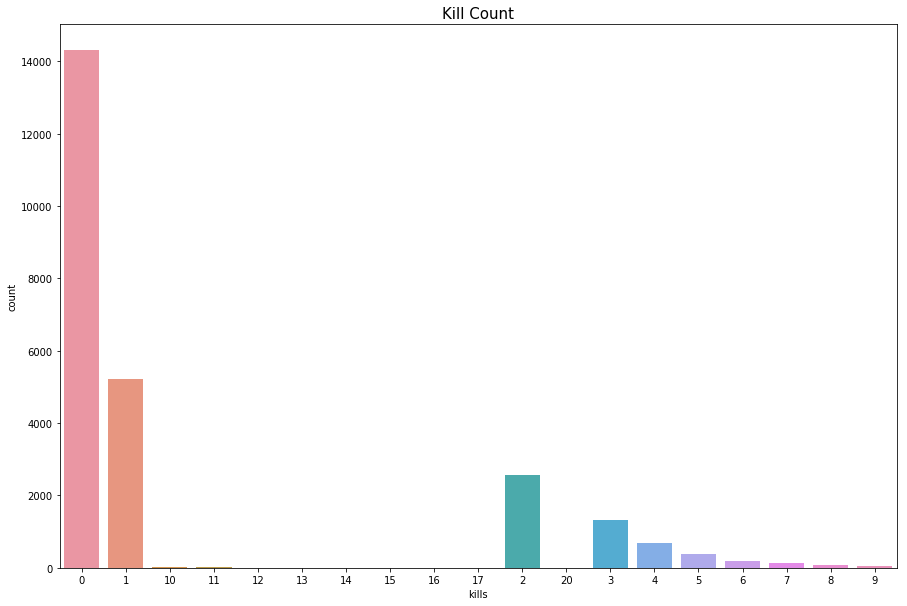


```python
print("Average kills "+str(train['kills'].mean())+" & Maximum kills is "+str(train['kills'].max()))
```

    Average kills 0.91712 & Maximum kills is 20


**Walking Distance Distribution**


```python
plt.figure(figsize=(15,10))
plt.title("Walking Distance Distribution",fontsize=15)
plt.hist(train['walkDistance'])
plt.xlabel("walkDistance")
plt.ylabel("Count")
plt.show()
```


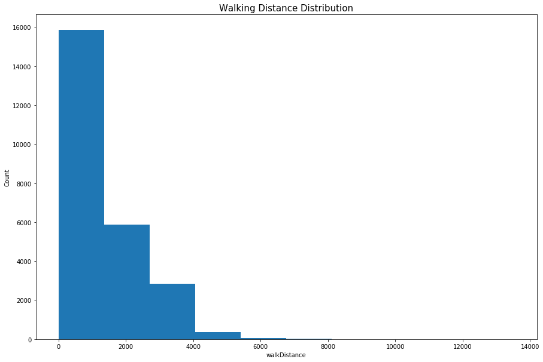


**Ride Distance Distribution**


```python
plt.figure(figsize=(15,10))
plt.title("Ride Distance Distribution",fontsize=15)
plt.hist(train['rideDistance'],bins =10,color= 'Green')
plt.xlabel('Distance Covered by vehicles')
plt.ylabel("Count")
plt.show()
```


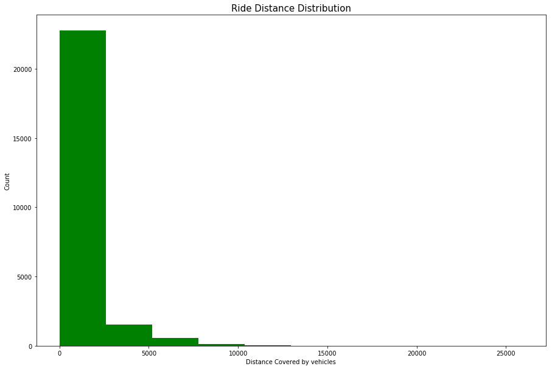


**Swim Distance Distribution**


```python
plt.figure(figsize=(15,10))
plt.title("Swim Distance Distribution",fontsize=15)
sns.distplot(train['swimDistance'])
plt.show()
```

    /opt/conda/lib/python3.6/site-packages/scipy/stats/stats.py:1713: FutureWarning: Using a non-tuple sequence for multidimensional indexing is deprecated; use `arr[tuple(seq)]` instead of `arr[seq]`. In the future this will be interpreted as an array index, `arr[np.array(seq)]`, which will result either in an error or a different result.
      return np.add.reduce(sorted[indexer] * weights, axis=axis) / sumval


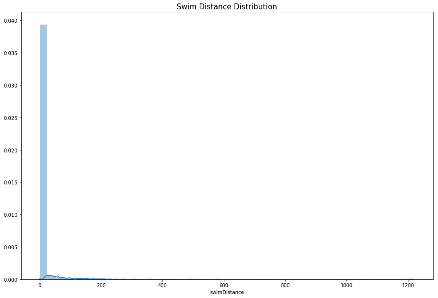


** Distribution on the basis of Match type**


```python
f,ax = plt.subplots(figsize=(15,8))
sns.barplot(train.matchType.value_counts().index,train.matchType.value_counts().values)
plt.xlabel('Count')
plt.ylabel('matchType')
plt.show()
```


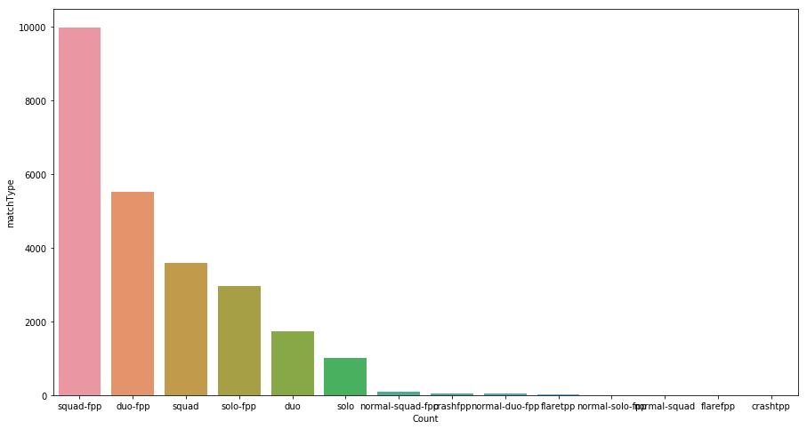


**Assist Distribution**


```python
assist = train.assists.value_counts()
assist = assist[assist.index>0]
f,ax = plt.subplots(figsize=(15,5))
ax = sns.barplot(assist.index,assist.values,palette='rainbow')
plt.xlabel('Assists')
plt.ylabel('Count')
plt.show()
```


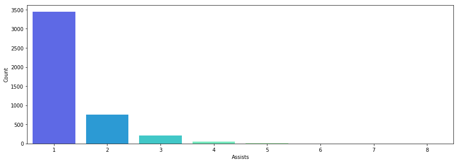


**DBNOs Distribution**


```python
f,ax = plt.subplots(figsize=(15,4))
ax = sns.distplot(train['DBNOs'],color='green')
plt.show()
```

    /opt/conda/lib/python3.6/site-packages/scipy/stats/stats.py:1713: FutureWarning: Using a non-tuple sequence for multidimensional indexing is deprecated; use `arr[tuple(seq)]` instead of `arr[seq]`. In the future this will be interpreted as an array index, `arr[np.array(seq)]`, which will result either in an error or a different result.
      return np.add.reduce(sorted[indexer] * weights, axis=axis) / sumval


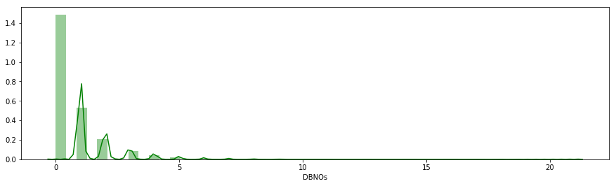


**Match Duration Distribution**


```python
f,ax = plt.subplots(figsize=(15,4))
ax = sns.distplot(train.matchDuration,color='blue')
plt.show()
```

    /opt/conda/lib/python3.6/site-packages/scipy/stats/stats.py:1713: FutureWarning: Using a non-tuple sequence for multidimensional indexing is deprecated; use `arr[tuple(seq)]` instead of `arr[seq]`. In the future this will be interpreted as an array index, `arr[np.array(seq)]`, which will result either in an error or a different result.
      return np.add.reduce(sorted[indexer] * weights, axis=axis) / sumval


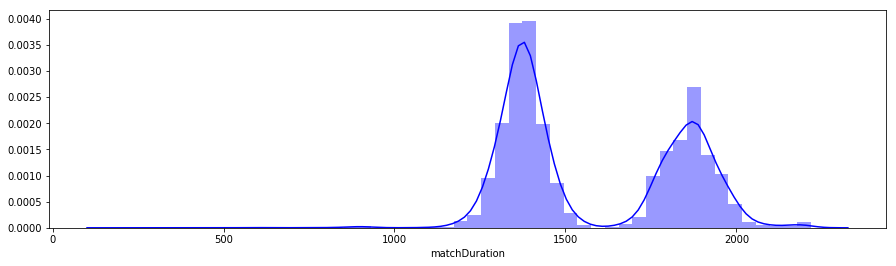


## Bivariate Analysis

**WinPlacePerc vs Kills**


```python
sns.jointplot(x="winPlacePerc", y="kills", data=train, height=10, color="r")
plt.show()
```

    /opt/conda/lib/python3.6/site-packages/scipy/stats/stats.py:1713: FutureWarning: Using a non-tuple sequence for multidimensional indexing is deprecated; use `arr[tuple(seq)]` instead of `arr[seq]`. In the future this will be interpreted as an array index, `arr[np.array(seq)]`, which will result either in an error or a different result.
      return np.add.reduce(sorted[indexer] * weights, axis=axis) / sumval


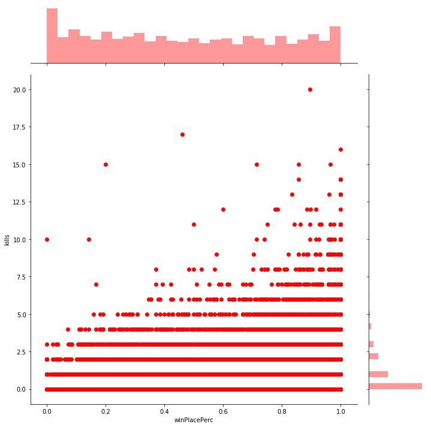


**Categories of Kills**


```python
killing_groups = train.copy()

killing_groups['killing_groups'] = pd.cut(killing_groups['kills'], [-1, 0, 2, 5, 10, 20], labels=['0 kills','1-2 kills', '3-5 kills', '6-10 kills', '10+ kills'])

plt.figure(figsize=(15,8))
sns.boxplot(x="killing_groups", y="winPlacePerc", data=killing_groups)
plt.show()
```


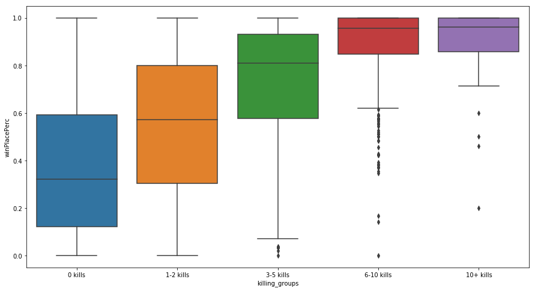


**winPlacePerc vs walkDistance**


```python
sns.jointplot(x ='winPlacePerc',y='walkDistance',data = train,height= 10,color='purple')
plt.show()
```

    /opt/conda/lib/python3.6/site-packages/scipy/stats/stats.py:1713: FutureWarning: Using a non-tuple sequence for multidimensional indexing is deprecated; use `arr[tuple(seq)]` instead of `arr[seq]`. In the future this will be interpreted as an array index, `arr[np.array(seq)]`, which will result either in an error or a different result.
      return np.add.reduce(sorted[indexer] * weights, axis=axis) / sumval


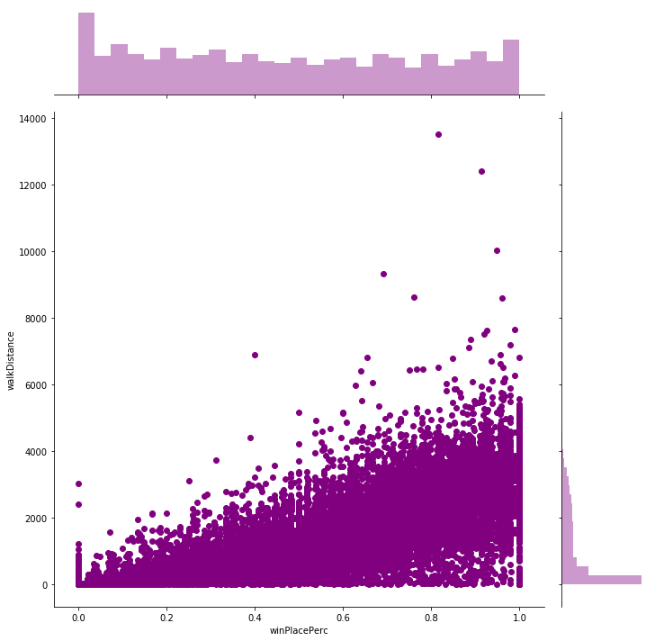


**winPlacePerc vs boosts**


```python
ax = sns.jointplot(x ='winPlacePerc',y='boosts',data = train,height=10,color='green')
plt.show()
```

    /opt/conda/lib/python3.6/site-packages/scipy/stats/stats.py:1713: FutureWarning: Using a non-tuple sequence for multidimensional indexing is deprecated; use `arr[tuple(seq)]` instead of `arr[seq]`. In the future this will be interpreted as an array index, `arr[np.array(seq)]`, which will result either in an error or a different result.
      return np.add.reduce(sorted[indexer] * weights, axis=axis) / sumval


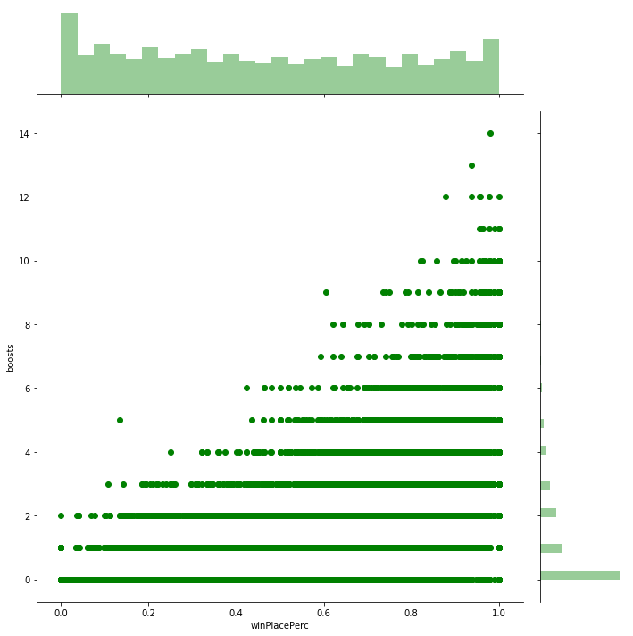


**winPlacePerc vs weaponsAcquired**


```python
ax = sns.jointplot(train['winPlacePerc'],train['weaponsAcquired'],height=10)
plt.show()
```

    /opt/conda/lib/python3.6/site-packages/scipy/stats/stats.py:1713: FutureWarning: Using a non-tuple sequence for multidimensional indexing is deprecated; use `arr[tuple(seq)]` instead of `arr[seq]`. In the future this will be interpreted as an array index, `arr[np.array(seq)]`, which will result either in an error or a different result.
      return np.add.reduce(sorted[indexer] * weights, axis=axis) / sumval


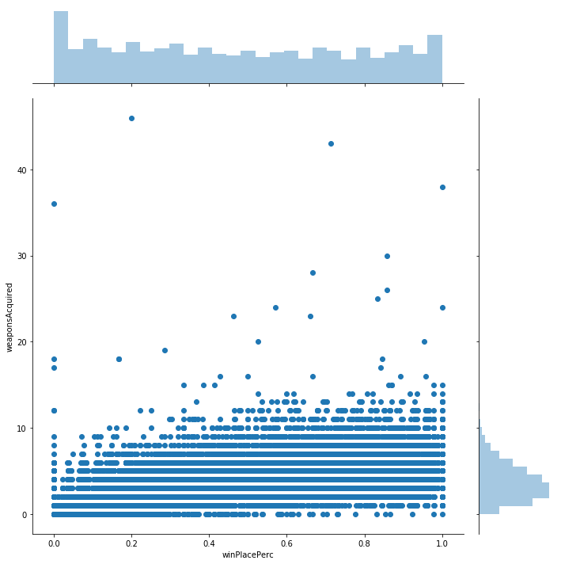


**winPlacePerc vs damageDealt**


```python
ax = sns.jointplot(train['winPlacePerc'],train['damageDealt'],height = 10,color ='violet')
plt.show()
```

    /opt/conda/lib/python3.6/site-packages/scipy/stats/stats.py:1713: FutureWarning: Using a non-tuple sequence for multidimensional indexing is deprecated; use `arr[tuple(seq)]` instead of `arr[seq]`. In the future this will be interpreted as an array index, `arr[np.array(seq)]`, which will result either in an error or a different result.
      return np.add.reduce(sorted[indexer] * weights, axis=axis) / sumval


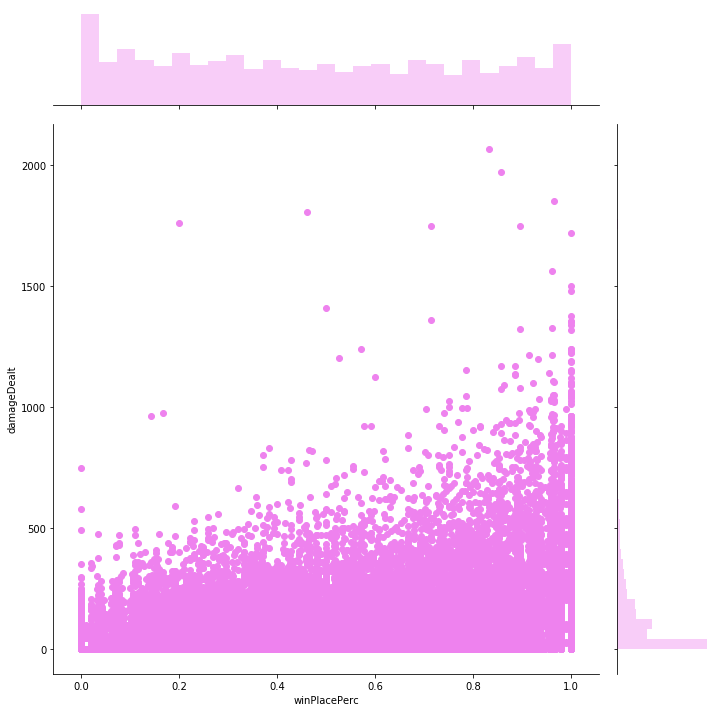


**winPlacePerc vs heals**


```python
ax = sns.jointplot(train['winPlacePerc'],train['heals'],height= 10,color='violet')
plt.show()
```

    /opt/conda/lib/python3.6/site-packages/scipy/stats/stats.py:1713: FutureWarning: Using a non-tuple sequence for multidimensional indexing is deprecated; use `arr[tuple(seq)]` instead of `arr[seq]`. In the future this will be interpreted as an array index, `arr[np.array(seq)]`, which will result either in an error or a different result.
      return np.add.reduce(sorted[indexer] * weights, axis=axis) / sumval


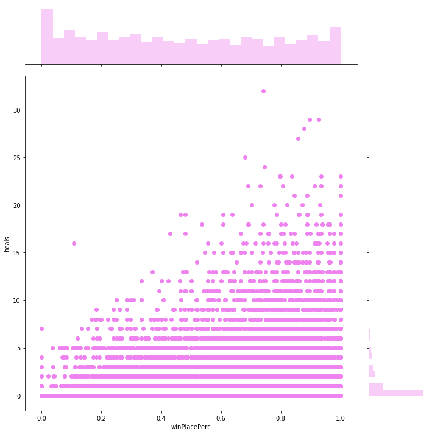


**Heals vs Boosts on winPlacePerc**


```python
f,ax1 = plt.subplots(figsize =(20,10))
sns.pointplot(x='heals',y='winPlacePerc',data=train,color='red',alpha=0.8)
sns.pointplot(x='boosts',y='winPlacePerc',data=train,color='blue',alpha=0.8)
plt.text(4,0.6,'Heals',color='red',fontsize = 15)
plt.text(4,0.55,'Boosts',color='blue',fontsize = 15)
plt.xlabel('Number of heal/boost items',fontsize = 15,color='blue')
plt.ylabel('Win Percentage',fontsize = 15,color='blue')
plt.title('Heals vs Boosts',fontsize = 20,color='blue')
plt.grid()
plt.show()
```

    /opt/conda/lib/python3.6/site-packages/scipy/stats/stats.py:1713: FutureWarning: Using a non-tuple sequence for multidimensional indexing is deprecated; use `arr[tuple(seq)]` instead of `arr[seq]`. In the future this will be interpreted as an array index, `arr[np.array(seq)]`, which will result either in an error or a different result.
      return np.add.reduce(sorted[indexer] * weights, axis=axis) / sumval


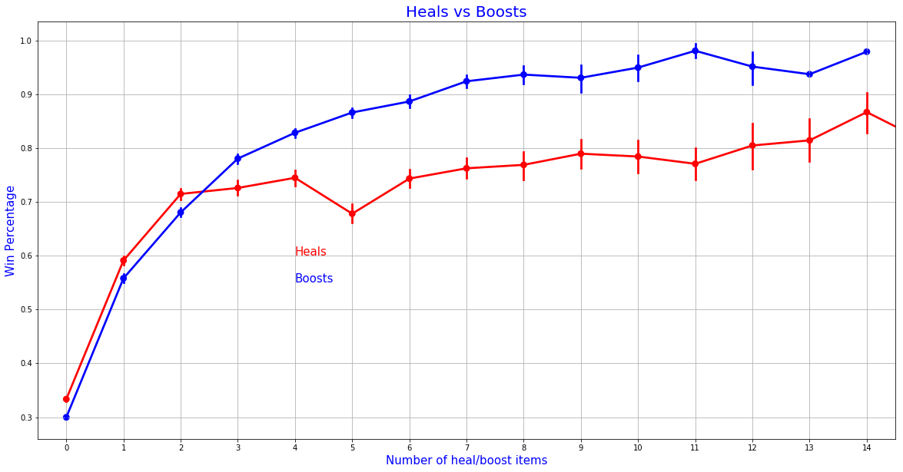


**winPlacePerc vs matchType(segmented)**


```python
# f,ax1 = plt.subplots(figsize =(20,10))
f,ax = plt.subplots(figsize=(20,10))
solos = train[train['numGroups']>50]
duos = train[(train['numGroups']>25) & (train['numGroups']<=50)]
squads = train[train['numGroups']<=25]

sns.pointplot(x='kills',y='winPlacePerc',data=solos,color='black',alpha=0.8)
sns.pointplot(x='kills',y='winPlacePerc',data=duos,color='#CC0000',alpha=0.8)
sns.pointplot(x='kills',y='winPlacePerc',data=squads,color='#3399FF',alpha=0.8)
plt.text(4,0.6,'Solos',color='black',fontsize = 15)
plt.text(4,0.55,'Duos',color='#CC0000',fontsize = 15)
plt.text(4,0.5,'Squads',color='#3399FF',fontsize = 15)
plt.xlabel('Number of kills',fontsize = 15)
plt.ylabel('Win Percentage',fontsize = 15)
plt.title('Solo vs Duo vs Squad Kills',fontsize = 20)
plt.grid()
plt.show()
```

    /opt/conda/lib/python3.6/site-packages/scipy/stats/stats.py:1713: FutureWarning: Using a non-tuple sequence for multidimensional indexing is deprecated; use `arr[tuple(seq)]` instead of `arr[seq]`. In the future this will be interpreted as an array index, `arr[np.array(seq)]`, which will result either in an error or a different result.
      return np.add.reduce(sorted[indexer] * weights, axis=axis) / sumval


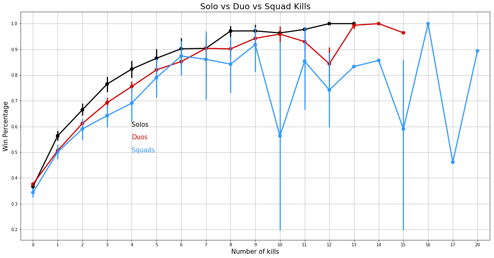


**Correlation on all features**


```python
train_new = train.copy()
train_new.drop(['Id','groupId','matchId','matchType'],inplace=True,axis=1)
f,ax = plt.subplots(figsize=(15,15))
ax = sns.heatmap(train_new.corr(),annot=True,fmt= '.1f',linewidths=.5)
plt.show()
```


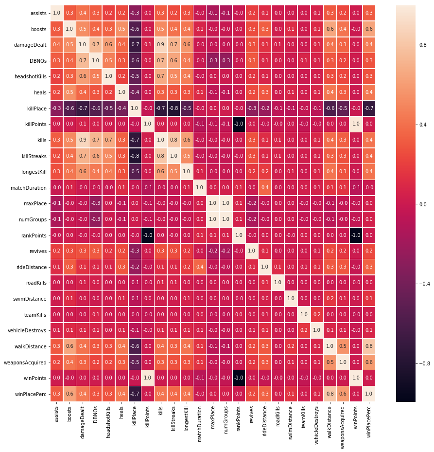


**Correlation on Highly correlated features**


```python
f,ax = plt.subplots(figsize=(10,10))
columns = ['boosts','killPlace','walkDistance','weaponsAcquired','damageDealt','kills','heals','headshotKills','winPlacePerc']
ax = sns.heatmap(train_new[columns].corr(),annot=True,fmt= '.1f',linewidths=.5)
plt.show()
```


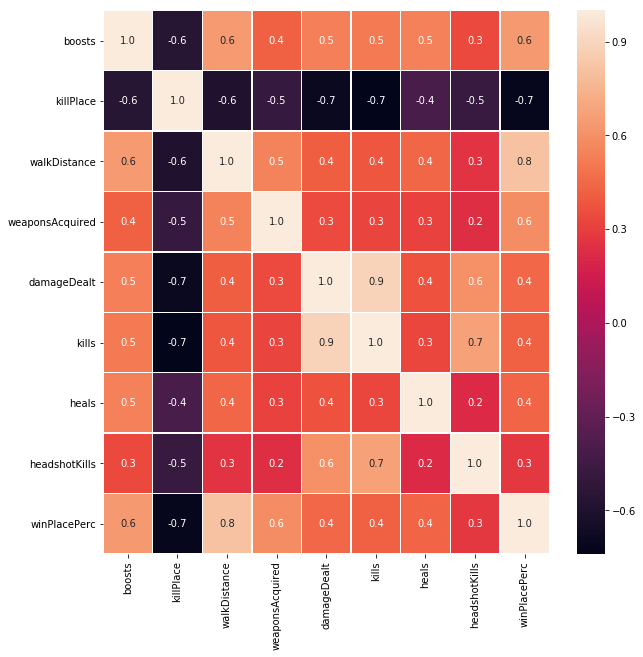


**Creating New Features (Feature Engineering)**


```python
train_new['healsandboosts'] = train_new['heals'] + train_new['boosts']
train_new['totalDistance'] = train_new['rideDistance'] + train_new['walkDistance'] + train_new['swimDistance']
train_new['headshot_rate'] = train_new['headshotKills'] / train_new['kills']
train_new['headshot_rate'] = train_new['headshot_rate'].fillna(0)
train_new[train_new['kills']>0].head()
```


<div>
<style scoped>
    .dataframe tbody tr th:only-of-type {
        vertical-align: middle;
    }

    .dataframe tbody tr th {
        vertical-align: top;
    }

    .dataframe thead th {
        text-align: right;
    }
</style>
<table border="1" class="dataframe">
  <thead>
    <tr style="text-align: right;">
      <th></th>
      <th>assists</th>
      <th>boosts</th>
      <th>damageDealt</th>
      <th>DBNOs</th>
      <th>headshotKills</th>
      <th>heals</th>
      <th>killPlace</th>
      <th>killPoints</th>
      <th>kills</th>
      <th>killStreaks</th>
      <th>longestKill</th>
      <th>matchDuration</th>
      <th>maxPlace</th>
      <th>numGroups</th>
      <th>rankPoints</th>
      <th>revives</th>
      <th>rideDistance</th>
      <th>roadKills</th>
      <th>swimDistance</th>
      <th>teamKills</th>
      <th>vehicleDestroys</th>
      <th>walkDistance</th>
      <th>weaponsAcquired</th>
      <th>winPoints</th>
      <th>winPlacePerc</th>
      <th>healsandboosts</th>
      <th>totalDistance</th>
      <th>headshot_rate</th>
    </tr>
  </thead>
  <tbody>
    <tr>
      <th>4</th>
      <td>0</td>
      <td>0</td>
      <td>100.00</td>
      <td>0</td>
      <td>0</td>
      <td>0</td>
      <td>45</td>
      <td>0</td>
      <td>1</td>
      <td>1</td>
      <td>58.530</td>
      <td>1424</td>
      <td>97</td>
      <td>95</td>
      <td>1560</td>
      <td>0</td>
      <td>0.0</td>
      <td>0</td>
      <td>0.00</td>
      <td>0</td>
      <td>0</td>
      <td>49.75</td>
      <td>2</td>
      <td>0</td>
      <td>0.1875</td>
      <td>0</td>
      <td>49.75</td>
      <td>0.0</td>
    </tr>
    <tr>
      <th>14</th>
      <td>0</td>
      <td>1</td>
      <td>122.80</td>
      <td>1</td>
      <td>0</td>
      <td>2</td>
      <td>25</td>
      <td>1411</td>
      <td>1</td>
      <td>1</td>
      <td>37.910</td>
      <td>1458</td>
      <td>31</td>
      <td>30</td>
      <td>-1</td>
      <td>1</td>
      <td>1237.0</td>
      <td>0</td>
      <td>60.29</td>
      <td>0</td>
      <td>0</td>
      <td>1666.00</td>
      <td>5</td>
      <td>1531</td>
      <td>0.9000</td>
      <td>3</td>
      <td>2963.29</td>
      <td>0.0</td>
    </tr>
    <tr>
      <th>16</th>
      <td>0</td>
      <td>2</td>
      <td>81.71</td>
      <td>1</td>
      <td>0</td>
      <td>14</td>
      <td>25</td>
      <td>0</td>
      <td>1</td>
      <td>1</td>
      <td>9.158</td>
      <td>1882</td>
      <td>27</td>
      <td>26</td>
      <td>1436</td>
      <td>0</td>
      <td>519.9</td>
      <td>0</td>
      <td>0.00</td>
      <td>0</td>
      <td>0</td>
      <td>3674.00</td>
      <td>7</td>
      <td>0</td>
      <td>0.7308</td>
      <td>16</td>
      <td>4193.90</td>
      <td>0.0</td>
    </tr>
    <tr>
      <th>20</th>
      <td>0</td>
      <td>4</td>
      <td>269.10</td>
      <td>0</td>
      <td>1</td>
      <td>8</td>
      <td>18</td>
      <td>0</td>
      <td>2</td>
      <td>1</td>
      <td>7.438</td>
      <td>1890</td>
      <td>48</td>
      <td>48</td>
      <td>1491</td>
      <td>1</td>
      <td>2734.0</td>
      <td>0</td>
      <td>0.00</td>
      <td>0</td>
      <td>0</td>
      <td>1794.00</td>
      <td>5</td>
      <td>0</td>
      <td>0.6383</td>
      <td>12</td>
      <td>4528.00</td>
      <td>0.5</td>
    </tr>
    <tr>
      <th>22</th>
      <td>0</td>
      <td>1</td>
      <td>192.30</td>
      <td>1</td>
      <td>2</td>
      <td>3</td>
      <td>15</td>
      <td>1022</td>
      <td>2</td>
      <td>1</td>
      <td>280.600</td>
      <td>1775</td>
      <td>49</td>
      <td>48</td>
      <td>-1</td>
      <td>0</td>
      <td>2332.0</td>
      <td>0</td>
      <td>0.00</td>
      <td>0</td>
      <td>0</td>
      <td>1264.00</td>
      <td>4</td>
      <td>1494</td>
      <td>0.7500</td>
      <td>4</td>
      <td>3596.00</td>
      <td>1.0</td>
    </tr>
  </tbody>
</table>
</div>


### Outliers
**Removing Outliers**

Cheaters := Having kills without any movement


```python
cheaters = len(train_new[((train_new['kills'] > 0) & (train_new['totalDistance'] == 0))].shape)
print ("No. of Players had kills without any movement(Cheaters): "+str(cheaters))
train_new.drop(train_new[((train_new['kills'] > 0) & (train_new['totalDistance'] == 0))].index, inplace=True)
print ("Deleted: "+str(cheaters))
```

    No. of Players had kills without any movement(Cheaters): 2
    Deleted: 2


```python
## timetoonekill
# x = train_new[train_new].matchDuration/(train_new['kills']*60)
# x.head()
plt.boxplot(train['rideDistance'])
plt.show()
# display(train[train['rideDistance'] >= 20000].shape)
```


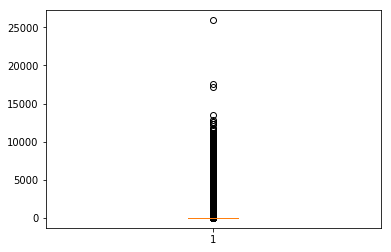


Removing Players having value more than 20000


```python
display(train_new[train_new['rideDistance'] >= 20000].shape)
train_new[train_new['rideDistance'] >= 20000].head(10)
train_new.drop(train_new[train_new['rideDistance'] >= 20000].index, inplace=True)
# display(train_new[train_new['rideDistance'] >= 20000].shape)
```


    (1, 28)


```python
f,ax = plt.subplots(figsize=(10,10))
columns = ['boosts','killPlace','walkDistance','weaponsAcquired','damageDealt','kills','heals','headshotKills','headshot_rate','healsandboosts','totalDistance','winPlacePerc']
ax = sns.heatmap(train_new[columns].corr(),annot=True,fmt= '.1f',linewidths=.5)
plt.show()
```


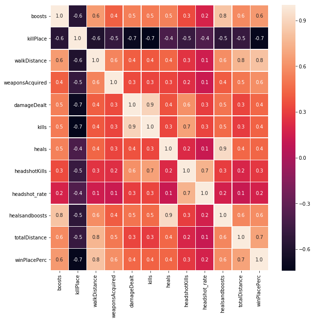


* **Positive correlations :-** boosts,walkDistance, weaponsAcquired, healsandboosts, totalDistance
* **Negative correlation :-** killPlace


```python
m = train_new.corr()['winPlacePerc']
m.sort_values(ascending=False).head(8)
```


    winPlacePerc       1.000000
    walkDistance       0.810239
    totalDistance      0.679510
    boosts             0.637735
    weaponsAcquired    0.593341
    healsandboosts     0.585082
    damageDealt        0.446762
    heals              0.435945
    Name: winPlacePerc, dtype: float64


**Using only Top Features**


```python
cols = ['walkDistance','killPlace','totalDistance','boosts','weaponsAcquired','healsandboosts','damageDealt','heals','winPlacePerc']
model_data = train_new[cols]
# model_data.shape
X = train_new.iloc[:,:7].values
Y = train_new.iloc[:,-1].values
```

**Train and Test Splitting** for model

**Feature Scaling** using Standard Scalar


```python
from sklearn.model_selection import train_test_split
train_X,test_X,train_Y,test_Y = train_test_split(X,Y,test_size = 0.30)
from sklearn.preprocessing import StandardScaler
sc = StandardScaler()  
train_X = sc.fit_transform(train_X)  
test_X = sc.transform(test_X) 
```

**Linear Regression** and its **r2_score**


```python
from sklearn.linear_model import LinearRegression
lin = LinearRegression()
lin.fit(train_X,train_Y)
pred_Y_LR = lin.predict(test_X)
from sklearn.metrics import r2_score
score_LR = r2_score(test_Y,pred_Y_LR)
print("Linear Regression r_2 score :"+str(score_LR))
```

    Linear Regression r_2 score :0.6219637175771431


**Random Forest** and its **r2_score**


```python
from sklearn.ensemble import RandomForestRegressor
reg = RandomForestRegressor(max_depth = 12,criterion='mse',n_estimators=100)
reg.fit(train_X,train_Y)
pred_Y_RF = reg.predict(test_X)
from sklearn.metrics import r2_score
score_RF = r2_score(test_Y,pred_Y_RF)
print("Random Forest r_2 score :"+str(score_RF))
```

    Random Forest r_2 score :0.979737861367881


## Thank You
### Future vision:- 
Improve more **features**, apply **feature engineering**, find more **insights** about **team, matches & maps**, improving this model with **better algorithms** and **gradient optimisation **
